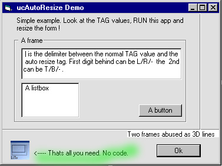



## ucAutoResize Controls \- Lean and usefull

### Description

]]] An improved AutoResize Usercontrol [[[ Put this small selfcontained usercontrol to your form, add

three chars to the tag property of every control to handle. Ready. Thats all! Based on the very good

submission of Hamed Oveisi (look/vote at PSC CodeId=49740) I tried to improve/change some things

('Refactoring' is the trendy word for ;) ):

* More possibilities in resizing (look at the 3D lines (frames) ).

* No more flickering when forms gets too small.

* No more call in the Form_Resize event neccessary. (In fact you didn't need ANY code.)

(Ups! Just check out Hamed's last update. He did the same ;) )

* The tag value still can be used for "standard" purposes. (But you will need a (very) litte

change in your code, sorry ;( )

* Its faster.

* Handling is easier/more straight forward. (Only two simple digits in tag value to enter, not four)

* Prepared for handling 'Lines', too. (Not done by me - I don't use lines ;) )

* A var naming convention is used, so code is easier to read/modify.

* Demo and description extended.

* ...

All -(C) Copyleft on 11/10/2003 - Light Templer (LiTe)
 
### More Info
 

             |
---                |---
**Submitted On**   |2003-11-11 11:09:54
**By**             |[Light Templer](https://github.com/Planet-Source-Code/PSCIndex/blob/master/ByAuthor/light-templer.md)
**Level**          |Intermediate
**User Rating**    |5.0 (30 globes from 6 users)
**Compatibility**  |VB 5\.0, VB 6\.0
**Category**       |[Custom Controls/ Forms/  Menus](https://github.com/Planet-Source-Code/PSCIndex/blob/master/ByCategory/custom-controls-forms-menus__1-4.md)
**World**          |[Visual Basic](https://github.com/Planet-Source-Code/PSCIndex/blob/master/ByWorld/visual-basic.md)
**Archive File**   |[ucAutoResi16706611112003\.zip](https://github.com/Planet-Source-Code/light-templer-ucautoresize-controls-lean-and-usefull__1-49820/archive/master.zip)

